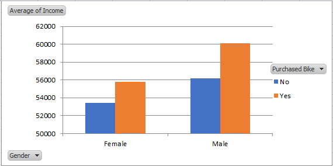
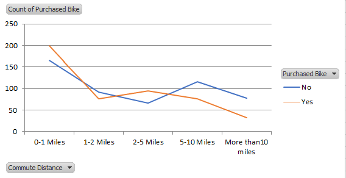
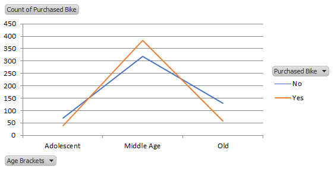

# Bike_Sales_Analysis
"An Excel-based analysis of bike sales data, examining purchasing trends by age, gender, and distance. Visualizations include charts illustrating average income by gender, purchasing count by distance, and trends over time."

## Overview
This project focuses on analyzing bike sales data based on various factors such as age, gender, and distance. The data has been cleaned to remove duplicates, and appropriate names have been provided for better understanding and analysis. Data visualizations have been generated to gain insights into the trends and patterns within the bike sales dataset.

## Data Cleaning
Removed duplicate entries to ensure data accuracy.
Provided meaningful names for easier interpretation of data.\

## Data Visualizations
The following visualizations have been created to represent the bike sales data:

Age Distribution of Customers: Visual representation of the age distribution of customers who purchased bikes.
Gender Analysis: Bar graph showing the gender distribution among bike buyers.
Distance Traveled: line chart illustrating the distance traveled by customers using the bikes.
Average Income by Gender: Bar graph displaying the average purchasing income of male and female customers.
Purchasing Count by Distance: line chart showing the purchasing count according to distance traveled.
Income Trend Over Time: Line chart depicting the trend of purchasing income over time.
Sales Volume Over Time: Line chart representing the trend of bike sales volume over time.

## Visualizations
here are the visualizations that are showed in pivot table

### Average of Income

### Count of purchased Bike by Distance

### Count of purchased Bike by Age

## Usage
To view and analyze the data:

1.Open the Excel file named Bike_Sales_Data.xlsx.
2.Navigate to the respective sheets containing cleaned data and visualizations.
3.Use filters, charts, and graphs to explore the data and gain insights into bike sales trends.

## Contributors
Siri S
